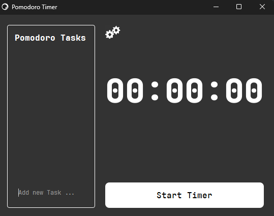

<div dir="rtl" align="right">

<h1 align="center">⏳ Pomodoto Timer</h1>
<p align="center">یک تایمر پومودورو ساده، حرفه‌ای و قابل‌سفارشی‌سازی با پایتون</p>

</div>

<div align="center">


</div>

---

<div dir="rtl" align="right">

# ⏳ پومودورو تایمر (Pomodoro Timer)

این پروژه یک تایمر پومودورو نوشته‌شده با پایتون است  
که به شما کمک می‌کند تمرکز بیشتری داشته باشید.

</div>

<div dir="rtl" align="right">

## ✨ امکانات (Features)

- ⏱ **چرخه کامل پومودورو** (Work / Short Break / Long Break)
- 🔄 **پیکربندی‌پذیر** (زمان کار – استراحت کوتاه – استراحت بلند)
- 🔔 **دارای اعلان (Notification)** یا صدای پایان تایمر
- 🧩 **معماری تمیز و قابل گسترش**

</div>

---

## 🖼️ اسکرین‌شات‌ها (Screenshots)

<div align="center">
  
</div>

---

<div dir="rtl" align="right">

## 🚀 نصب و اجرا

### 1️⃣ کلون کردن پروژه

</div>

```bash
git clone https://github.com/your-username/pomodoto-timer.git
cd pomodoto-timer
